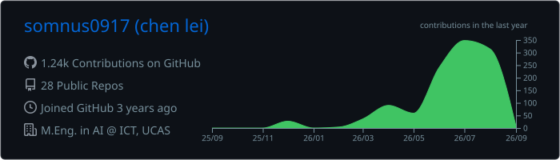

<div align="center">

# Hi, I'm Chen Lei 👋


<div align="center">

[](https://blog.somnus.wiki)
[](mailto:dev@somnus.wiki)
[](https://resume.somnus.wiki/zh/)


[](https://www.swjtu.edu.cn/)
[](https://english.ict.cas.cn/)


</div>
</div>

## About me

- 🎓 M.Eng. in Artificial Intelligence @ Institute of Computing Technology, UCAS
- 🎓 B.Eng. in Intelligent Manufacturing Engineering @ Southwest Jiaotong University
- 🧭 Based in Nanjing
- 🦀 Building and learning with Rust, Python, TypeScript and JavaScript
- 🤖 Interested in LLM systems, model tooling, RAG and practical AI applications
- 💬 “Talk is cheap. Show me the code.”


## Toolbox

<div align="center">


</div>

# Featured projects

### [Koku](https://github.com/somnus0917/koku)

**Self-hosted finance platform.** A privacy-first personal finance application built with Rust, SQLite and TypeScript.

### [luopanhacker](https://github.com/somnus0917/luopanhacker)

**Live e-commerce platform.** A TikTok multi-store data collection, analytics and operations system.

### [RAFT Stereo Ultra](https://github.com/somnus0917/RAFT-Stereo)

**Undergraduate research project.** A lightweight RAFT-Stereo implementation focused on efficient stereo matching.

### [Superlabel](https://github.com/somnus0917/superlabel)

**Released desktop app.** A local-first object detection annotation tool with ONNX-assisted labeling.

### [ripfullpage](https://github.com/somnus0917/ripfullpage)

**Chrome Web Store extension.** A native browser extension for full-page and region screenshots.


## GitHub activity

<p align="center">
  
</p>

## Coding activity

<!--START_SECTION:waka-->


**🐱 My GitHub Data** 

> 📦 188.1 kB Used in GitHub's Storage 
 > 
> 🏆 1,012 Contributions in the Year 2026
 > 
> 🚫 Not Opted to Hire
 > 
> 📜 40 Public Repositories 
 > 
> 🔑 4 Private Repositories 
 > 
**I'm an Early 🐤** 

```text
🌞 Morning                354 commits         ███░░░░░░░░░░░░░░░░░░░░░░   12.06 % 
🌆 Daytime                1233 commits        ██████████░░░░░░░░░░░░░░░   42.00 % 
🌃 Evening                988 commits         ████████░░░░░░░░░░░░░░░░░   33.65 % 
🌙 Night                  361 commits         ███░░░░░░░░░░░░░░░░░░░░░░   12.30 % 
```
📅 **I'm Most Productive on Monday** 

```text
Monday                   547 commits         █████░░░░░░░░░░░░░░░░░░░░   18.63 % 
Tuesday                  498 commits         ████░░░░░░░░░░░░░░░░░░░░░   16.96 % 
Wednesday                517 commits         ████░░░░░░░░░░░░░░░░░░░░░   17.61 % 
Thursday                 535 commits         █████░░░░░░░░░░░░░░░░░░░░   18.22 % 
Friday                   343 commits         ███░░░░░░░░░░░░░░░░░░░░░░   11.68 % 
Saturday                 287 commits         ██░░░░░░░░░░░░░░░░░░░░░░░   09.78 % 
Sunday                   209 commits         ██░░░░░░░░░░░░░░░░░░░░░░░   07.12 % 
```


📊 **This Week I Spent My Time On** 

```text
🕑︎ Time Zone: Asia/Shanghai

💬 Programming Languages: 
Rust                     12 hrs 29 mins      █████████████████░░░░░░░░   66.03 % 
TypeScript               3 hrs 6 mins        ████░░░░░░░░░░░░░░░░░░░░░   16.45 % 
CSS                      1 hr 29 mins        ██░░░░░░░░░░░░░░░░░░░░░░░   07.88 % 
Markdown                 55 mins             █░░░░░░░░░░░░░░░░░░░░░░░░   04.86 % 
YAML                     26 mins             █░░░░░░░░░░░░░░░░░░░░░░░░   02.36 % 

🔥 Editors: 
Zed                      12 hrs 53 mins      █████████████████░░░░░░░░   68.18 % 
Codex Vscode             5 hrs 50 mins       ████████░░░░░░░░░░░░░░░░░   30.90 % 
Antigravity CLI          10 mins             ░░░░░░░░░░░░░░░░░░░░░░░░░   00.92 % 

🐱‍💻 Projects: 
oni-rocket-calculator    10 hrs 40 mins      ██████████████░░░░░░░░░░░   56.46 % 
koku                     6 hrs 58 mins       █████████░░░░░░░░░░░░░░░░   36.90 % 
love                     54 mins             █░░░░░░░░░░░░░░░░░░░░░░░░   04.79 % 
luopanhacker             12 mins             ░░░░░░░░░░░░░░░░░░░░░░░░░   01.07 % 
Unknown Project          5 mins              ░░░░░░░░░░░░░░░░░░░░░░░░░   00.52 % 

💻 Operating System: 
Linux                    18 hrs 54 mins      █████████████████████████   100.00 % 
```

**I Mostly Code in Rust** 

```text
Rust                     14 repos            ██████████░░░░░░░░░░░░░░░   40.00 % 
Python                   8 repos             ██████░░░░░░░░░░░░░░░░░░░   22.86 % 
TypeScript               6 repos             ████░░░░░░░░░░░░░░░░░░░░░   17.14 % 
HTML                     4 repos             ███░░░░░░░░░░░░░░░░░░░░░░   11.43 % 
JavaScript               3 repos             ██░░░░░░░░░░░░░░░░░░░░░░░   08.57 % 
```


 Last Updated on 25/08/2026 20:43:41 UTC
<!--END_SECTION:waka-->

<div align="center">


</div>
